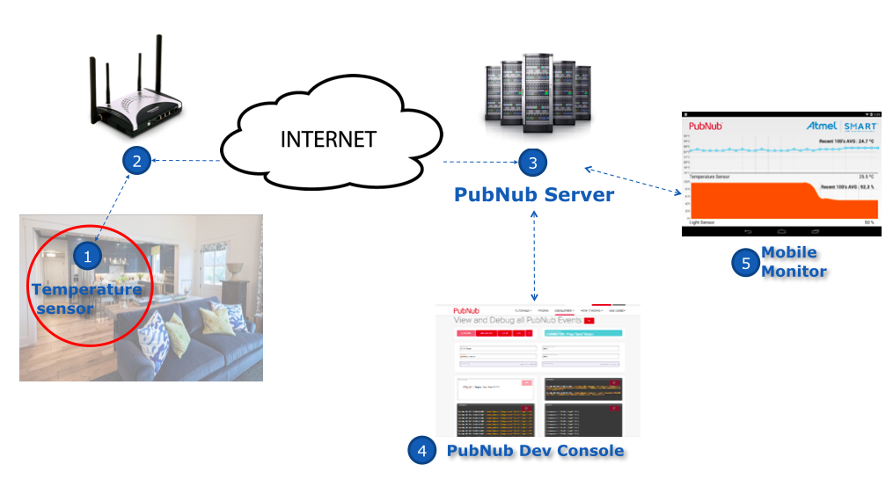
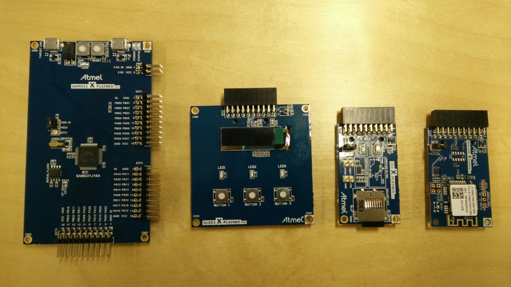
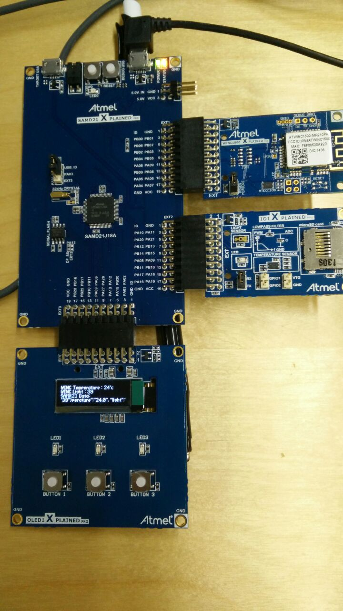
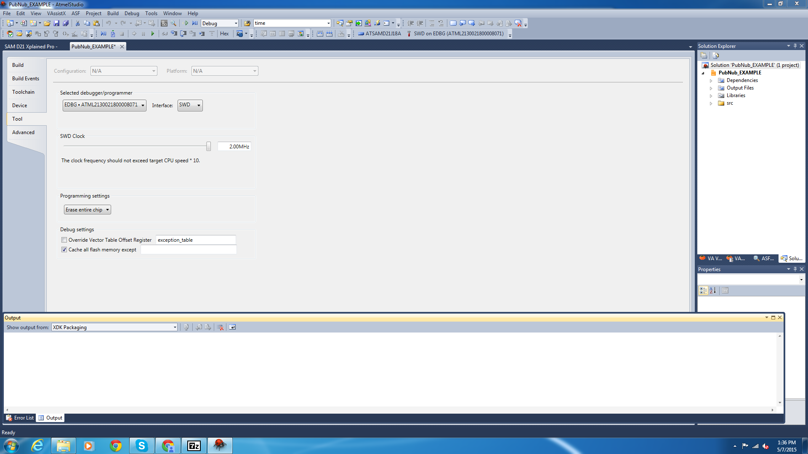
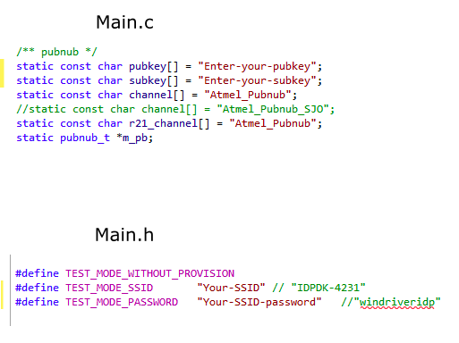
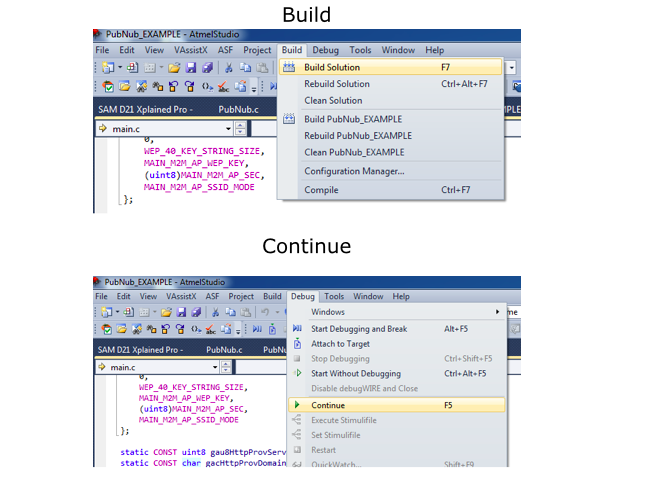
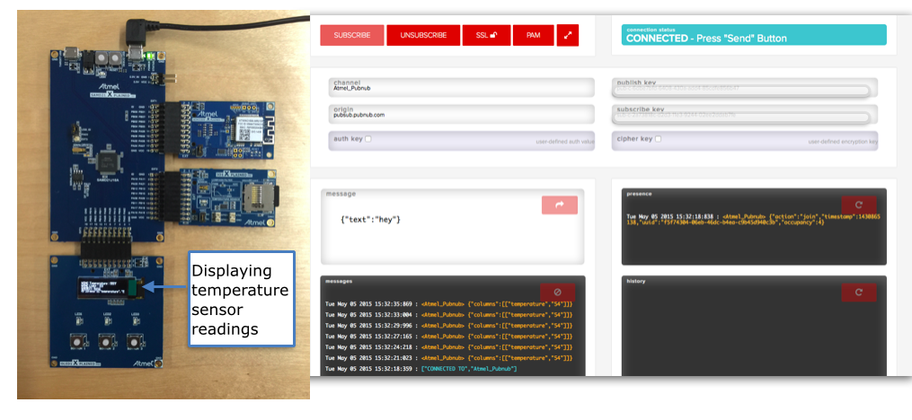

#PubNub - Atmel Xplained Pro Real Time Temperature Sensor 
 
 
## What exactly is this, and what does it do?

The Atmel temperature sensor enables monitoring temperature from anywhere in the world at low-latency, and provides updates in realtime whenever the temperature changes. 
The temperature sensor will measure the ambient temperature and publish it as a data stream to a channel in the PubNub network. A web browser that subscribes to this channel displays the data stream. 

### The concept: 



1. The Atmel I/O1 Xplained Pro sensor measures the ambient temperature. 
2. This connects to the Wi-Fi using the ATWINC1500 module.
3. The PubNub code running on the Atmel chip enables us to **publish** the temperature in real time to any one subscribing to the same channel as a data stream.
4. Through the [pubnub developer console](http://www.pubnub.com/console/), you can receive this stream of information from as many sensors as you like in real time. 
 

### 1. What do you need?

####1.1 **Hardware**

	
	

1. **[ATSAMD21-XPRO](http://www.atmel.com/tools/atsamd21-xpro.aspx)** host MCU board.
2. **[OLED 1 Xplained pro](http://www.atmel.com/tools/atoled1-xpro.aspx)** to provide the display on the chip.  
3. Atmel **[I/O1 Xplained Pro](http://www.atmel.com/tools/atio1-xpro.aspx)** for sensor and SD-card input to host MCU
4. **[ATWINC1500](http://www.atmel.com/devices/atwinc1500.aspx)** module. This is a Wi-Fi black box that contains the Wi-Fi stack, the TCP stack and the TLS stack.
	

####1.2 **Software**

1. Windows PC
2. Sign up for [PubNub](https://www.pubnub.com), and get a set of publish and subscribe keys 
3. Install Atmel Studio 6.2
4. Instal ASF
5. Install updates to Atmel Studio as suggested during installation
6. Install terminal software like putty or teraterm (I have used putty)

**A prerequisite is that you upgrade the firmware for SAMD21 before you run this demo. Make sure no other software like putty or teraterm is using the com port). Close Atmel studio and the putty terminal. The firmware upgrade is successful if you see a PASS sign on the terminal after running the code.**


###2. Connecting the hardware, the right way : 

1. Connect WINC1500 XPRO board to SAMD21 XPRO connector EXT1
2. Connect I/O1 XPRO board to SAMD21 XPRO connector EXT2
3. Connect OLED1 XPRO board to SAMD21 XPRO connector EXT3
4. Connect SAMD21 XPRO to a free USB port on your PC (make sure no other USB port on your PC is in use)
5. Connect the power to the port that says “DEBUG USB”
	
	
	
	
###3. The Software 

3.1 Open the PubNub example solution in Atmel Studio and you will see the following page. Make sure you choose the debugger/programmer and interface as shown: 

	

3.2  Include the following lines in `main.h`: 
	
```
#define TEST_MODE_SSID "Enter-your-SSID"	(choose THE Wi-Fi access point you want the chip to connect to)
#define TEST_MODE_PASSWORD "Enter-the password-for-the-SSID" (enter the password for the same Wi-Fi connection)
#define TEST_MODE_WITHOUT_PROVISION
```

3.3 In `main.c`, add the channel name and pub, sub keys. 

	

3.4 Build (F7 / Build -> build solution), run(continue/ green arrow/ F5/ debug -> continue).
	

3.5 Open [PubNub console] (http://www.pubnub.com/console/), use the **same channel name and pub,sub keys** as in the code and SUBSCRIBE. 

3.6 If all is well, you should see a constant stream of messages in the following format :                  
	      <Atmel_Pubnub> {"columns":[["temperature","55.00"]]}
	
	

###4. Visualizing the data stream


Tomomi, built a live demo for this and can be seen here : [Atmel Xplained Pro Demo](http://pubnub.github.io/atmel-temperature-demo/). It mocks nursery or greenhouse monitor(a very typical use case of using temperature sensors), instead of just displaying raw data off the sensor. This interface is running on a browser. The technology behind is quite simple, using [PubNub JavaScript APIs](https://www.pubnub.com/docs/javascript/javascript-sdk.html) to subscribe the data sent from the Atmel chip.

This interface is accessible from anywhere in the world with any kind of device - mobile phones, tablets, and any smart device, as long as you have a web browser.
The main purpose behind this is to present information in most efficient manner without losing its accuracy.

In this scenario, the UI shows the current temperature, also a simple line graph, updating in **real time** so that you can tell the relative changes of the temperature, raising and dropping.

This particular data is simple, but when you have multiple, more complicated data, data visualization plays more crucial role. 


### Go Conquer IoT

This demo is read-only and reads the ambient temperature, but in reality, you want to develop  products that lets your users monitor *and* control, i.e, **bidirectional communication** between devices. For instance, if you have a smart A/C, not only monitoring the current room temperature, but you need to make it controllable from a remote devices. With the power of [PubNub APIs](https://www.pubnub.com/developers/), you can achieve this with no hassle. 
I hope I am leaving you guys with enough excitement to try this demo out, and also build cooler ones. Let me know at @bhavana1110. 


